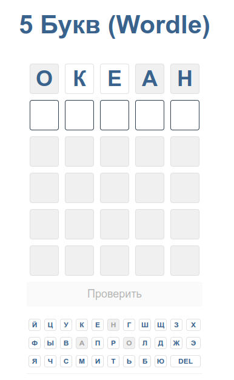

# Wordle (5 букв)
Игра "5 букв" или Wordle

В начале игры появляется поле, состоящее из 30 клеток, по пять штук в строчках и по шесть штук в столбцах.

В это поле можно вписать шесть слов, состоящих из пяти букв. Принимаются только существительные в единственнем числе.

Ниже клавиатура на которой показывается статус букв.

Начинайте вводить любое слово, как например слово «океан», нажмите на кнопку Ввод и буквы поменяют цвет.

Расшифровка такая — желтый фон буквы — слово на своем месте, белый — есть в слове но в другом месте, серый — буквы в слове нет.



----

Проект написан VueJS 3.

Для его сборки надо иметь установленный npm с VueJS 3.
```
npm run build
```
Либо можно скачать уже собранную версию из dist и открыть локально в броузере index.html
